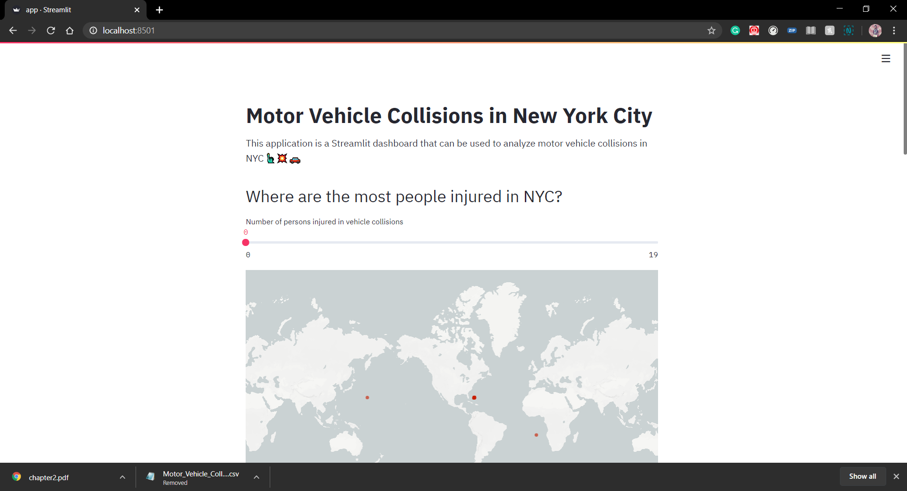
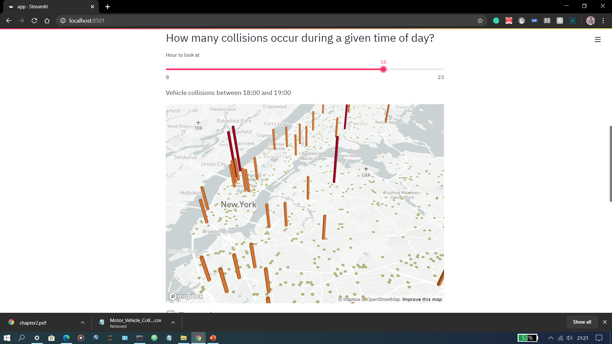
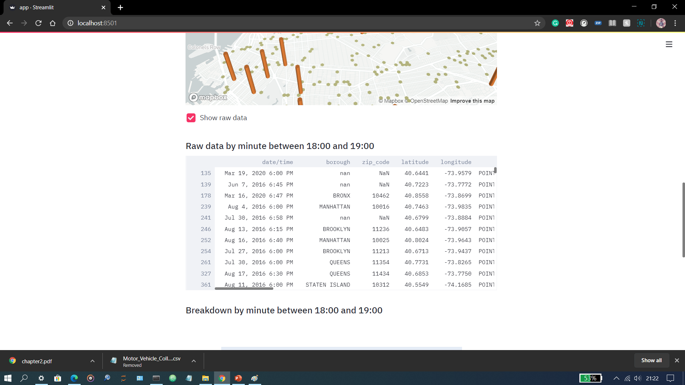

# Vehicle_collision_NewYork
#### Table of contents
1. [Description](#description)
2. [Requirements](#requirements)
3. [Steps](#steps)
4. [Screenshots](#screenshots)
5. [Acknowledgement](#acknowledgement)

<a name="description"></a>
# Description
Vehicle collision NewYork is webapp which show data with help of the maps.Maps shows data with location.Places in NewYork Where collision happened is showen with help of streamlit and pandas.Streamlit handle Front end. Pandas and Numpy are used for data analysis.

<a name="requirements"></a>
# Requirements
* Python 3.6
* Numpy
* Pandas
* Streamlit
* plotly

<a name="steps"></a>
# Steps
1. download all the files and place it in same folder
2. run following command ```streamlit run app.py```

<a name="screenshots"></a>
# Screenshots






<a name="acknowledgement"></a>
# Acknowledgement
Thank you Coursera for Guided Project 
here is my certificate https://www.coursera.org/account/accomplishments/certificate/Y54AFBZTKB8Z
